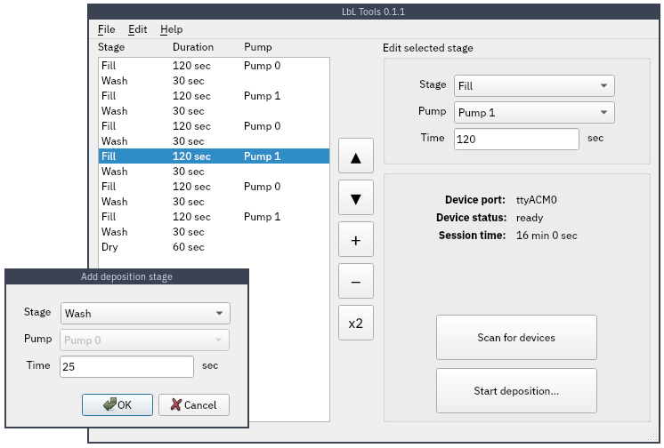

# LbL (Layer-by-Layer) Tools

Program for controlling deposition order used by an automatic [LbL deposition](https://en.wikipedia.org/wiki/Layer_by_layer) machine, and a part of my senior project at university. Allows you to add/remove stages, and manipulate the order of LbL sessions (stored as .lbl files).

Syntax for the LbL files is pretty funky:
```
<stage type>:<arg1>,<arg2>;
```
where `<stage-type>` is a single character: (`f`,`w`, or `d`), the second argument is the pump number (for FILL stages), and the final argument is the duration in seconds. Example:
```
f:1,120;
w:30;
d:15;
```
### Screenshot

