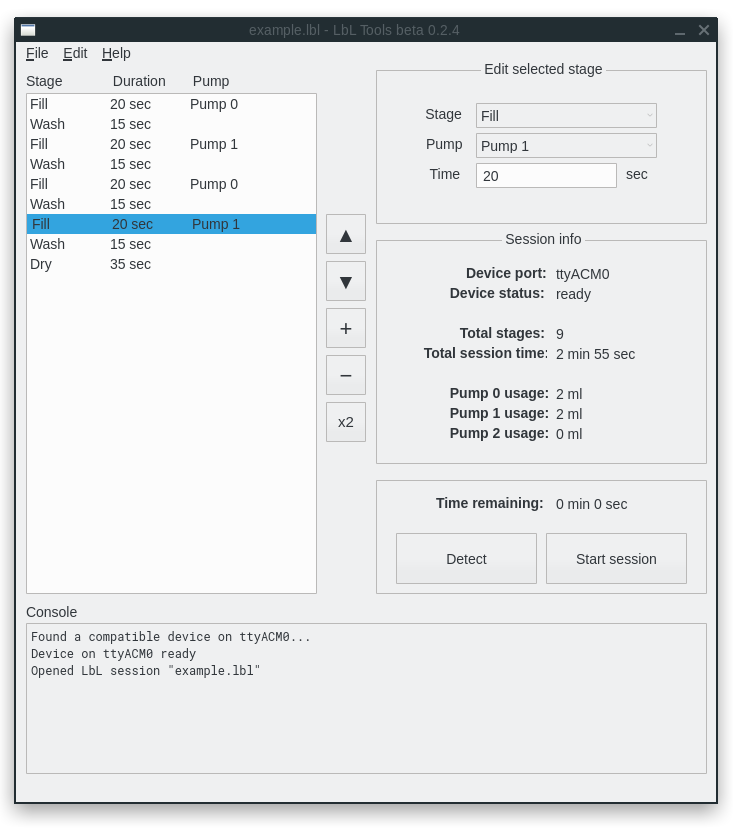

# LbL (Layer-by-Layer) Tools

Program for controlling deposition order used by an automatic [LbL deposition](https://en.wikipedia.org/wiki/Layer_by_layer) machine, and a part of my senior project at university. Allows you to add/remove stages, and manipulate the order of LbL sessions (stored as .lbl files).

Syntax for the LbL files is reasonably simple:
```
<stage type> <key>:<value>
<stage type> <key>:<value> <key>:<value>
```
where `<stage-type>` is one of three (`fill`, `wash`, or `dry`). The `<key>:<value>` pair can be pump number `p` (`fill` stages only), or duration `t` -- both requiring an integer value. Commands are terminated by line break. Example:
```
fill p:0 t:30
wash t:25
dry t:60
```
### Screenshot

